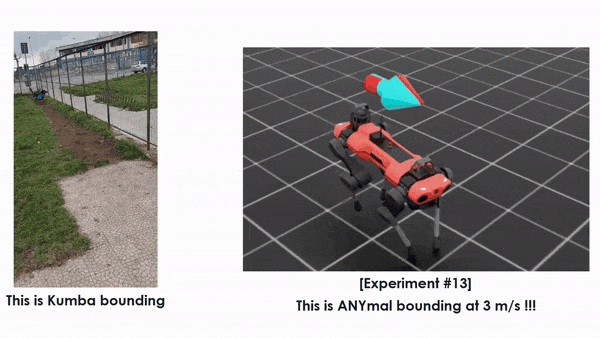
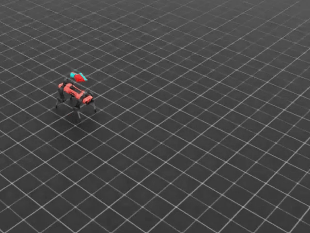
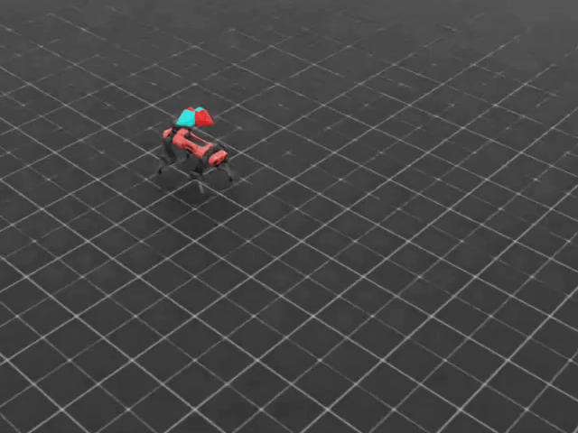
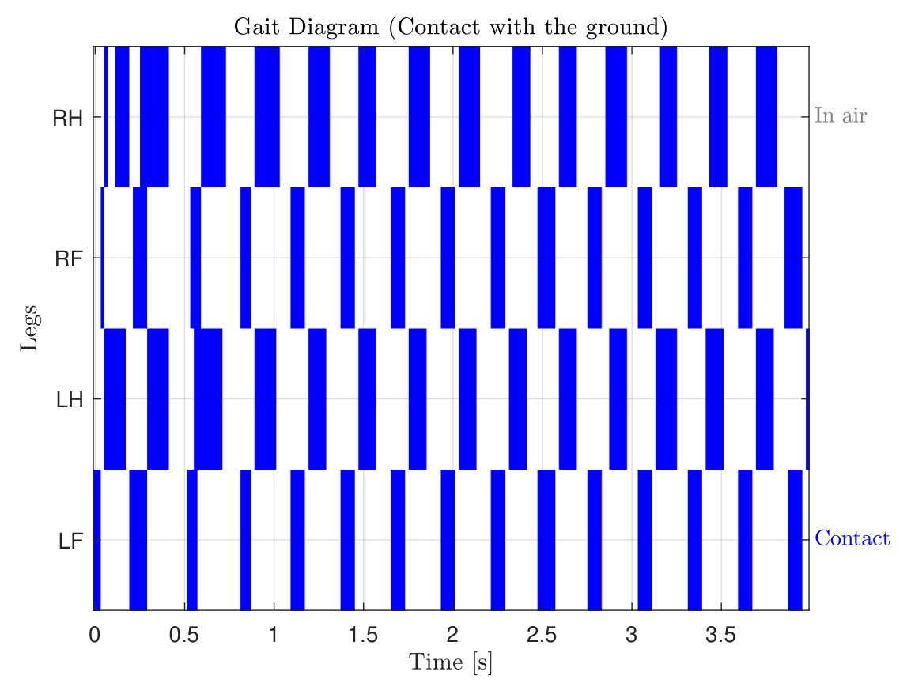

# 🐕 Biologically-Inspired Bounding Gait on ANYmal-C

[](https://github.com/isaac-sim/IsaacLab)
[](https://pytorch.org/)
[](https://www.nvidia.com)

**Reinforcement Learning framework for high-speed quadrupedal locomotion, featuring Curriculum Learning and custom Reward Shaping.**

This project implements a Reinforcement Learning framework to enforce a dynamic Bounding Gait on the ANYmal-C robot. By leveraging Curriculum Learning and custom Reward Shaping for phase synchronization , the policy achieves stable locomotion up to 3.0 m/s. The training pipeline is specifically optimized to run efficiently on consumer-grade hardware (RTX 3060 Laptop) within the NVIDIA Isaac Lab environment.

<div align="center">
  
  <p><b>Final Policy:</b> Stable Bounding Gait at ~3.0 m/s</p>
</div>

## 💡 Overview & Motivation
Standard RL baselines often produce generic trotting gaits. This project aims to force the emergence of a specific, high-dynamic **Bounding Gait** (synchronous movement of front/hind leg pairs) typically seen in nature during high-speed chases. 

**Key Challenges:**
* **Constrained Compute:** Training a massive parallel RL environment on a consumer laptop (RTX 3060 Mobile).
* **Behavior Engineering:** Designing a mathematical reward structure that discourages the energetically optimal "trot" in favor of the requested "bound".

<div align="center">
  <table width="10">
    <tr>
      <td align="center">
        
        <br />
        <b>Early Failure:</b> Instability without Curriculum Learning.
      </td>
      <td align="center">
        
        <br />
        <b>Emergent Trot:</b> First stable gait achieved at 0.5 m/s.
      </td>
    </tr>
  </table>
</div>

## ⚙️ Methodology

### 1. Reward Shaping for Gait Emergence
Instead of using motion capture data (Reference-based), we utilized a **Procedural Reward Shaping** approach. The standard reward function was augmented with custom terms to enforce phase relations:
* **Synchronization Reward:** Penalizes phase offsets between left and right legs of the same pair.
* **Alternation Reward:** Enforces anti-phase movement between front and hind pairs.
* **Flight Phase Incentive:** Rewards time periods where *no feet* are in contact with the ground (crucial for bounding).

*Snippet from `anymal_c_env.py`:*
```python
# Reward for leg pair synchronization
sync_front = torch.exp(-torch.square(contact_anterior_L - contact_anterior_R))
sync_hind = torch.exp(-torch.square(contact_posterior_L - contact_posterior_R))

# Reward for flight phase (dynamic motion)
num_feet_in_contact = torch.sum(is_contact, dim=1)
flight_reward = (num_feet_in_contact == 0)
```


### 2. Curriculum Learning
To prevent policy collapse at high speeds (where the robot would initially fall), we implemented a Velocity Curriculum:
 - **Stage 1:** Train stable walking at 0.5 m/s.
 - **Stage 2:** Linearly increase command velocity command max range based on success rate.
 - **Stage 3:** Final fine-tuning at 3.0 m/s with full bounding rewards active.

## 📊 Results & Analysis
### Gait Analysis
We validated the emergence of the gait by analyzing the foot contact patterns. As shown in the Gait Diagram below, the policy successfully learned to synchronize the front (LF+RF) and hind (LH+RH) pairs, with distinct flight phases (white gaps).

<div align="center">  <p>Contact pattern analysis.</p> </div>

### Energy & Autonomy
We conducted a power consumption analysis based on the computed joint torques and velocities.
- **Average Power:** Computed via integral of mechanical power over the trajectory.
- **Estimated Autonomy:** ~42 minutes (based on ANYmal-C 932 Wh battery spec).

## 🛠️ Reproduction
This repository contains the configuration overrides and environment logic compatible with **Isaac Lab 4.5.0**.
 1. **Install Isaac Lab:** Follow the [official guide](https://isaac-sim.github.io/IsaacLab/).
 2. **Setup:** Place the envs and configs folders into your extension directory.
 3. **Train:**
 ```Bash
 # Run headless to save VRAM on Laptop GPUs
 python scripts/train.py --task=Isaac-Velocity-Rough-Anymal-C-v0 --headless --video
 ```
## 📄 Project Report
For a deep dive into the SEA (Serial Elastic Actuator) modeling attempts and detailed physics analysis, please refer to the full Project Report (PDF).

*Coursework for Field and Service Robotics, University of Naples Federico II.*
